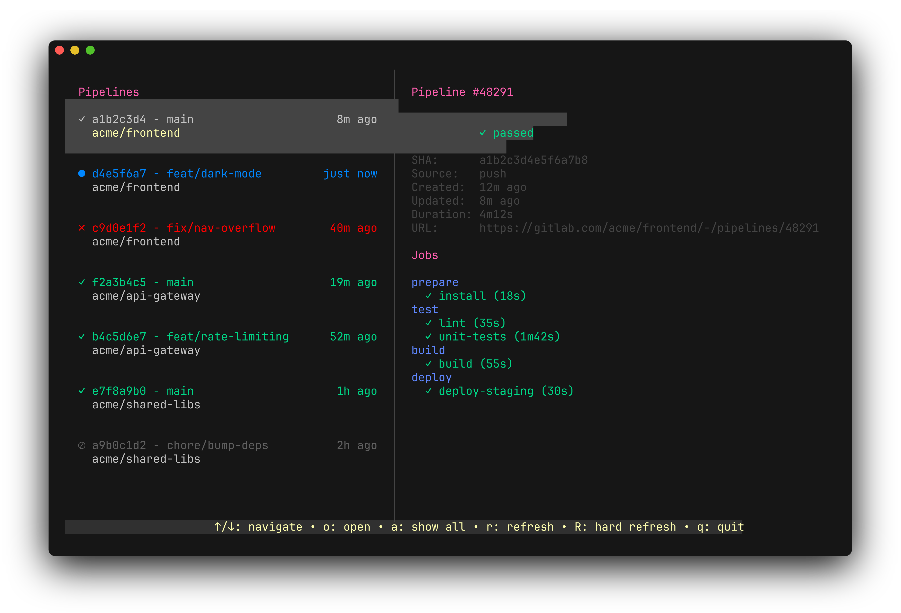

# GitLab Pipelines TUI

> **Note:** This project is under active development. Features and APIs may change.

A terminal UI for viewing your recent GitLab pipelines. Discovers pipelines from your activity and displays them in a navigable table with job status summaries.



All GitLab communication goes through the [`glab`](https://gitlab.com/gitlab-org/cli) CLI — no tokens or HTTP configuration required beyond `glab auth login`.

## Prerequisites

- Go 1.22+
- `glab` CLI installed and authenticated (`glab auth login`)

## Install

```
go install github.com/navitronic/gitlab-pipelines/cmd/gitlab-pipelines@latest
```

Or build from source:

```
go build -o gitlab-pipelines ./cmd/gitlab-pipelines/
```

## Usage

```
./gitlab-pipelines
```

The application discovers your recent push activity, fetches associated pipelines, and displays them in a table.

## Keyboard Shortcuts

### Pipeline List

| Key | Action |
|-----|--------|
| `↑` / `↓` | Navigate pipelines |
| `Enter` | View pipeline details |
| `r` | Refresh pipelines |
| `R` | Clear cache and refetch all data |
| `q` / `Ctrl+C` | Quit |

### Pipeline Details

| Key | Action |
|-----|--------|
| `Esc` / `Backspace` | Back to list |
| `q` / `Ctrl+C` | Quit |

## Features

- **Auto-refresh** — pipelines refresh every 30 seconds
- **Responsive layout** — columns adapt to terminal width
- **Job summaries** — pass/fail counts per pipeline
- **Status indicators** — colored icons for pipeline and job states (✓ passed, ✗ failed, ● running, ○ pending, ⊘ canceled)
- **Detail view** — pipeline metadata and jobs grouped by stage with duration

## How It Works

1. Fetches your user profile via `glab api user`
2. Retrieves your recent push events to identify active projects
3. For each project, fetches pipelines matching your commits (by SHA, ref, or fallback)
4. Displays results in a navigable TUI table
5. Selecting a pipeline shows its jobs grouped by stage
